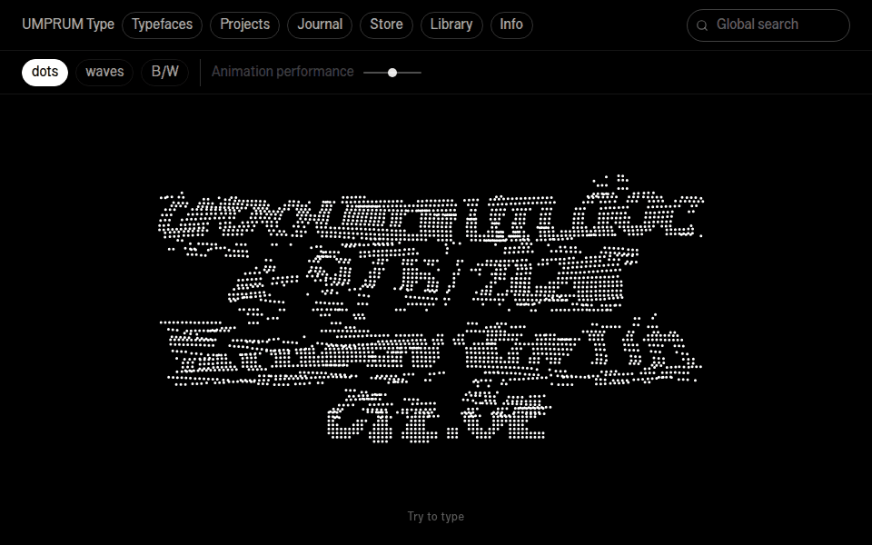
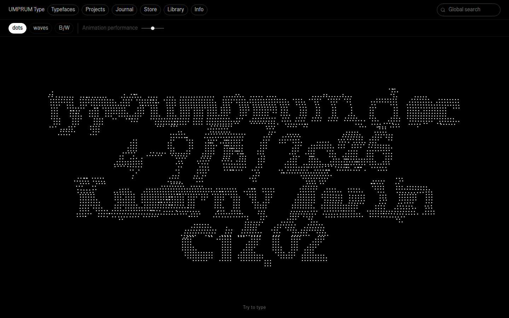
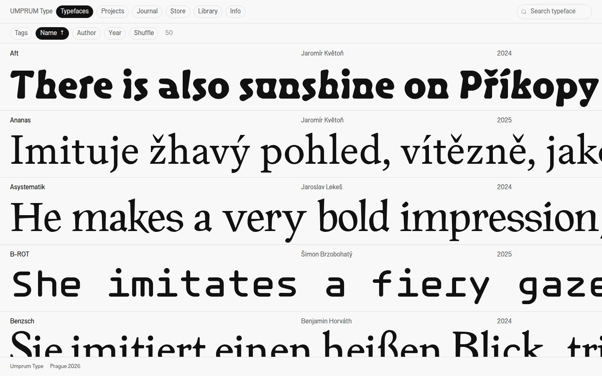
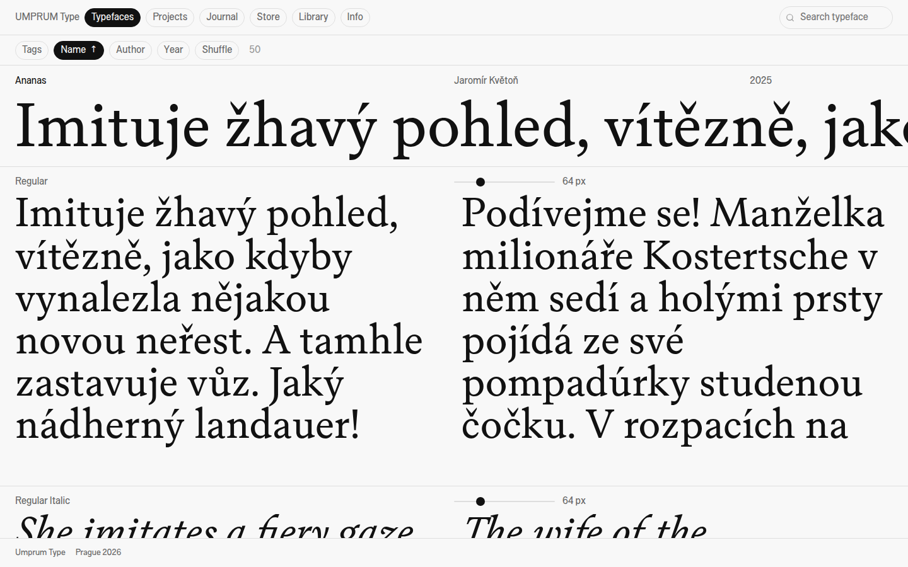
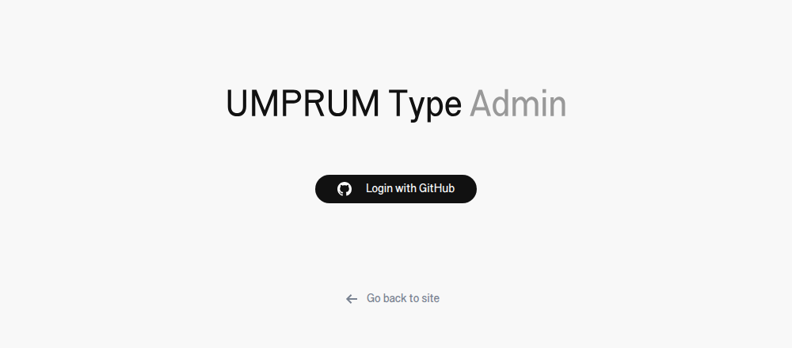

<div align="center">

# UMPRUM Type

**The archive of the Studio of Typography at UMPRUM, Prague**<br>
typefaces · projects · journal · store · library

[**typoumprum.cz**](https://typoumprum.cz)

<br>

<a href="https://typoumprum.cz"></a>

</div>

<br>

## About

A living archive of work from the Studio of Typography at the Academy of Arts, Architecture and Design in Prague (UMPRUM). There are 50 typefaces by 25 designers, each one shown only in text its glyphs were drawn for. Alongside them are the studio's projects, journal, a small store and its book library.

Two rules shape the site: **the home page is chaos, the archives are quiet**, and **a typeface is never compromised**. That means no random pangrams and no characters a font doesn't have.

<br>

<table>
  <tr>
    <td width="50%" valign="top">
      
      <p><b>Home</b><br>Kinetic type drawn in dots or waves from the studio's own typefaces. Visitors can type into it; the palette and quality are adjustable, and the page follows the system's light or dark theme.</p>
    </td>
    <td width="50%" valign="top">
      
      <p><b>Typefaces</b><br>One line per typeface, set in the typeface itself, that you can spin endlessly sideways. Sort, shuffle, filter by tags, search.</p>
    </td>
  </tr>
  <tr>
    <td width="50%" valign="top">
      
      <p><b>Specimen</b><br>Open a typeface for a tester per style, with a size slider and columns that follow the size. Text is read-only: only the font's own sample text is shown.</p>
    </td>
    <td width="50%" valign="top">
      
      <p><b>Admin</b><br>Decap CMS restyled to match the site. The forms explain where every field appears, and each post gets its own photo uploads.</p>
    </td>
  </tr>
</table>

<br>

## Sections

| | |
| :--- | :--- |
| **Typefaces** | Specimens built at build time from `public/fonts/<Name>/` (`.woff2` + `info.txt`) |
| **Projects / Journal** | Title · Author · Year rows with an image strip; posts open into a narrow reading column with photos placed between the paragraphs |
| **Store** | Projects marked *Sell in Store* — no prices, contact the author |
| **Library** | The studio's books, read live from a Google Sheet; tags, publisher and covers come straight from the table |
| **Info** | About the studio |

The search box in the top bar filters whichever section you're on. On the home page it searches the whole site.

<br>

## Stack

**[Astro 6](https://astro.build)** pages with **React 19** islands · plain CSS, no framework · Canvas for the home animation · **[Decap CMS](https://decapcms.org)** with GitHub login (OAuth functions in `api/`) · hosted on **Vercel** · Library data from **Google Sheets**

The UI is set in **Svar** by Šimon Brzobohatý.

<br>

## Editing content

| What | Where |
| :--- | :--- |
| Projects, journal posts, typeface details | **[typoumprum.cz/admin](https://typoumprum.cz/admin)** — log in with GitHub. Publishing commits to `main` and the site redeploys. |
| A new typeface | Add a folder to `public/fonts/` with the `.woff2` files and an `info.txt` (`name`, `designer`, `date`, `styleText0…`, `tags`, …) |
| Library books | The Google Sheet. Columns are matched by name: `Name`, `Author`, `Year`, `Tags`, `Image`, and optionally `Publisher` |

Uploaded photos are compressed automatically by a GitHub Action (`.github/workflows/optimize-images.yml`).

<br>

## Development

Requires Node 22.

```sh
npm install
npm run dev       # localhost:4321
npm run build     # static build into dist/
npm run preview   # serve the build
```

```text
src/
  components/   React islands — TypefaceIsland, ProjectsIsland, JournalIsland, LibraryIsland, HeroSketch…
  content/      Markdown for projects, journal and typeface overrides (written by the CMS)
  layouts/      Base.astro — top bar, footer
  lib/          typefaces.ts (reads public/fonts), site search, helpers
  pages/        one page per section + search.json
  styles/       global.css — one stylesheet, tokens at the top
public/
  admin/        Decap CMS: config.yml, theme, logo
  fonts/        typeface folders
  uploads/      photos for projects and journal posts
api/            GitHub OAuth for the CMS (Vercel functions)
```

<br>

---

<sub>
Website built by <a href="https://github.com/yunglordsimens">Masha Foreign</a>. All typefaces are the work of their individual designers, credited on the site.
<br><br>
This project was created with financial support from the Ministry of Culture of the Czech Republic as part of the Program for the Applied Research of National and Cultural Identity (NAKI III). It is one of the outcomes of the project <i>Sites of Creativity. Arts and Crafts Education: Constructing Identities, Rescuing Heritage, Designing the Future</i> (DH23P03OVV061).
</sub>
